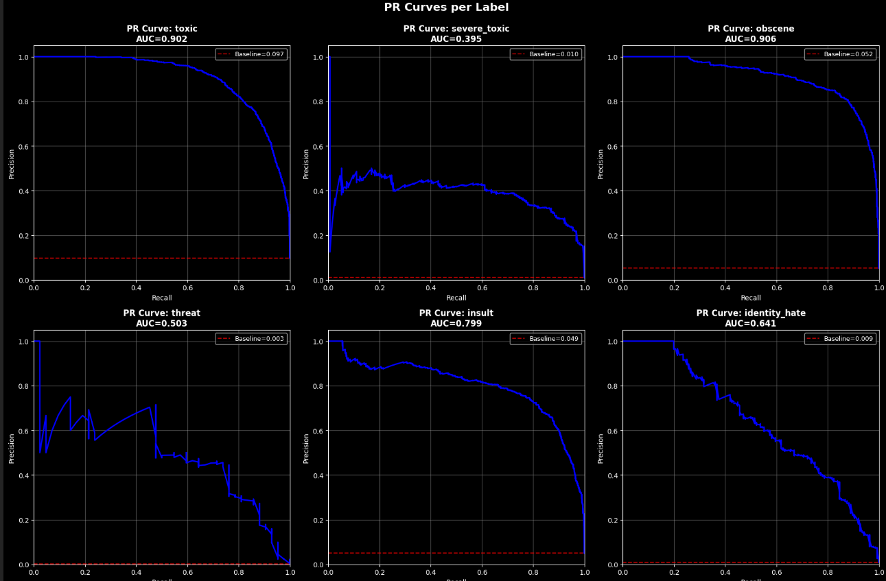
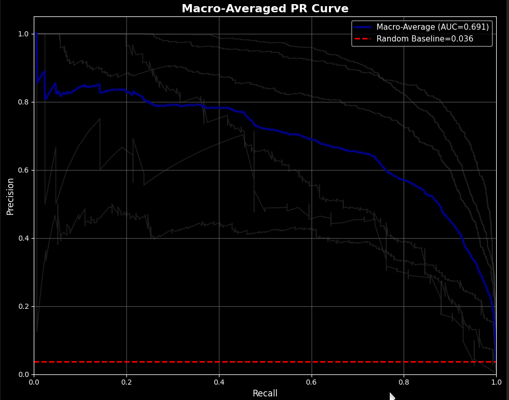

# Nontoxic World: Multi-Label Toxic Comment Classification

## 🎯 Problem Statement

The Nontoxic World project addresses the critical NLP challenge of automatically detecting toxic content in online comments across multiple dimensions. In digital platforms like Wikipedia, maintaining healthy discussions requires identifying various forms of toxicity including:

- **Toxic** - General toxic behavior
- **Severe Toxic** - Extremely harmful content  
- **Obscene** - Vulgar or offensive language
- **Threat** - Direct threats of violence
- **Insult** - Personal attacks
- **Identity Hate** - Hate speech targeting identity groups

This is a **multi-label classification problem** where comments can exhibit multiple toxicity types simultaneously. The primary challenge is the severe class imbalance (8.81:1 ratio) where toxic comments are rare but critical to detect.

---

## 🔬 Scientific Workflow

### 1. Data Acquisition & Understanding
- **Dataset**: [Wikipedia Toxic Comments Classification Challenge](https://www.kaggle.com/competitions/jigsaw-toxic-comment-classification-challenge/data)
- **Size**: 159,571 comments with 6 toxicity labels
- **Split**: 143,613 training, 15,958 test samples

### 2. Exploratory Data Analysis (EDA)
**Key Findings:**
- **Severe Class Imbalance**: Toxic comments represent only 9.61% of data
- **Label Co-occurrence**: Strong correlations between toxic↔obscene, toxic↔insult
- **Comment Length**: Mean 67.4 words, median 36 (right-skewed distribution)
- **Vocabulary**: Estimated 100K+ unique tokens before preprocessing

### 3. Data Preprocessing Pipeline
**Text Normalization:**
```python
# Core preprocessing steps
- Handle empty comments → "[UNK]"
- Lowercase conversion
- URL normalization → "[UNK]"
- Character stretching normalization ("loooool" → "lool")
- Whitespace normalization

# Wikimedia-specific preprocessing
- Convert [[link|text]] → text
- Remove templates {{...}}
- Remove bold/italic markup
- Remove headings
```

### 4. Tokenization Strategy
**Dual Tokenizer Approach:**
1. **BBPE (Byte-level BPE)**: Custom tokenizer trained on dataset
   - Vocabulary: 30,000 tokens
   - Minimum frequency: 2
   - Max sequence length: 256
   
2. **BERT Tokenizer**: Pre-trained `bert-base-uncased`
   - Leverages contextual embeddings
   - Same sequence length for consistency

### 5. Model Architecture Evolution

**Experimental Progression:**

| Model | Architecture | PR-AUC | F1-Score | Key Innovation |
|-------|-------------|--------|----------|----------------|
| TF-IDF + LR | Classical ML | 0.62 | 0.54 | Baseline |
| Stacked GRU | 1-layer GRU | 0.55 | 0.54 | First neural approach |
| Stacked BiGRU | 2-layer BiGRU | 0.62 | 0.60 | Bidirectional context |
| BiGRU + BERT | Pretrained embeddings | 0.69 | 0.67 | Transfer learning |
| BiGRU + Attention | Scaled dot-product attention | 0.69 | 0.70 | **Best model** |




**Final Architecture (StackedBiGRUWithScaledAttention):**
```
BERT Embeddings (frozen, 768-dim) 
    ↓
Stacked BiGRU (3 layers, 128 hidden units, dropout=0.5)
    ↓
Scaled Dot-Product Attention (Q/K/V projections)
    ↓
Masked Mean Pooling
    ↓
Linear Layer → 6 logits (sigmoid activation)
```

### 6. Training Strategy
**Hyperparameters:**
- **Optimizer**: AdamW (lr=0.001, weight_decay=0.01)
- **Loss**: BCEWithLogitsLoss with class weights
- **Batch Size**: 256 with dynamic padding
- **Learning Rate Scheduling**: ReduceLROnPlateau (factor=0.1, patience=2)

**Class Imbalance Handling:**
- Positive class weights computed from training data frequencies
- Macro PR-AUC as primary evaluation metric
- Per-label threshold optimization

### 7. Evaluation & Results
**Performance Metrics:**
- **Primary**: Macro PR-AUC (handles class imbalance)
- **Secondary**: Macro F1-Score
- **Threshold Optimization**: Per-label threshold tuning

**Best Model Performance:**
- Macro PR-AUC: **0.69**
- Macro F1-Score: **0.70** @ threshold 0.84

---

## 🏗️ Project Structure

```
nontoxic-world/
├── 📁 back-end/                    # FastAPI inference server
│   ├── 📁 app/
│   │   ├── main.py                 # FastAPI application & endpoints
│   │   ├── models.py               # PyTorch model definitions
│   │   ├── preprocessing.py        # Text preprocessing pipeline
│   │   ├── schemas.py              # Pydantic request/response models
│   │   └── services.py             # Model loading & inference logic
│   ├── Dockerfile                  # Backend container configuration
│   └── pyproject.toml              # Backend dependencies
│
├── 📁 front-end/                   # Streamlit web interface
│   ├── app.py                      # Main Streamlit application
│   ├── 📁 assets/                  # CSS & static assets
│   ├── 📁 components/              # UI components (input, prediction, viz)
│   ├── 📁 services/                # API client & error handling
│   ├── 📁 utils/                   # Helper functions & session state
│   ├── Dockerfile                  # Frontend container configuration
│   └── pyproject.toml              # Frontend dependencies
│
├── 📁 notebooks/                   # Jupyter notebooks for development
│   ├── 00_define_problem.ipynb     # Problem definition & metrics
│   ├── 01_get_data.ipynb           # Data acquisition
│   ├── 02_explore_data_analysis.ipynb  # EDA & insights
│   ├── 03_preprocessing_and_tokenization.ipynb  # Text preprocessing
│   ├── 04_baseline_model.ipynb     # TF-IDF baseline
│   ├── 05_build_models_and_train_from_scratch.ipynb  # Custom models
│   └── 06_build_models_with_pretrained_embeddings.ipynb  # Transfer learning
│
├── 📁 experiments/                 # Experiment documentation
│   ├── eda_report.md               # Detailed EDA findings
│   ├── preprocessing_plan.md       # Preprocessing strategy
│   ├── baseline_tfidf_logreg.md     # Baseline results
│   └── project_summary.md          # Complete project summary
│
├── compose.yaml                    # Docker Compose configuration
├── pyproject.toml                  # Root dependencies
└── README.md                       # This file
```

---

## 🛠️ Tools & Libraries

### 🐍 Python Environment
- **Package Manager**: `uv` (modern, fast Python package management)
- **Python Version**: 3.13+
- **Virtual Environment**: Isolated per component

### 🤖 Machine Learning Stack
| Library | Purpose | Version |
|---------|---------|---------|
| **PyTorch** | Deep learning framework | ≥2.9.1 |
| **Transformers** | BERT tokenizer & utilities | ≥5.3.0 |
| **Tokenizers** | Custom BBPE tokenizer | ≥0.22.2 |
| **Datasets** | Efficient data loading | ≥4.6.1 |
| **Scikit-learn** | Baseline models & metrics | ≥1.8.0 |
| **TorchMetrics** | Evaluation metrics | ≥1.9.0 |
| **Optuna** | Hyperparameter optimization | ≥4.8.0 |

### 📊 Data Science & Visualization
| Library | Purpose |
|---------|---------|
| **Pandas** | Data manipulation & analysis |
| **NumPy** | Numerical computing |
| **Matplotlib** | Plotting & visualization |
| **Seaborn** | Statistical visualization |
| **W&B** | Experiment tracking & logging |

### 🌐 Web Development
**Backend (FastAPI):**
- **FastAPI**: Modern, fast web framework
- **Uvicorn**: ASGI server
- **Pydantic**: Data validation & serialization
- **HuggingFace Hub**: Model checkpoint storage

**Frontend (Streamlit):**
- **Streamlit**: Rapid web application development
- **Requests**: HTTP client for API communication

### 🐳 Containerization & Deployment
- **Docker**: Containerization of services
- **Docker Compose**: Multi-container orchestration
- **Health Checks**: Robust service monitoring

---

## 🚀 Quick Start

### Prerequisites
- Python 3.13+
- Docker & Docker Compose
- `uv` package manager

### Installation & Setup

1. **Clone the repository:**
```bash
git clone <repository-url>
cd nontoxic-world
```

2. **Start the application:**
```bash
# Using Docker Compose (recommended)
docker-compose up --build

# Or run services individually
cd back-end && uv run uvicorn app.main:app --reload --port 8000
cd front-end && uv run streamlit run app.py --server.port 8501
```

3. **Access the application:**
- Frontend: http://localhost:8501
- Backend API: http://localhost:8000
- API Docs: http://localhost:8000/docs

---

## 📡 API Reference

### Health Check
```http
GET /health
```

### Available Models
```http
GET /models
```

### Prediction
```http
POST /predict
Content-Type: application/json

{
  "text": "Your comment here",
  "model_name": "StackedBiGRUWithScaledAttention"
}
```

### Response Format
```json
{
  "original_text": "Your comment here",
  "preprocessed_text": "your comment here",
  "probabilities": {
    "toxic": 0.87,
    "severe_toxic": 0.10,
    "obscene": 0.22,
    "threat": 0.08,
    "insult": 0.21,
    "identity_hate": 0.09
  },
  "predictions": {
    "toxic": true,
    "severe_toxic": false,
    "obscene": false,
    "threat": false,
    "insult": true,
    "identity_hate": false
  },
  "is_toxic": true,
  "model_used": "StackedBiGRUWithScaledAttention"
}
```


## 🎯 Key Insights & Learnings

### Technical Insights
1. **Transfer Learning Wins**: Pretrained BERT embeddings significantly outperformed trained-from-scratch embeddings
2. **Attention Mechanism**: Scaled dot-product attention provided marginal gains over pure BiGRU
3. **Class Imbalance**: Proper handling through weighting and PR-AUC optimization was crucial
4. **Tokenization**: Custom BBPE tokenizer performed comparably to BERT for this domain
